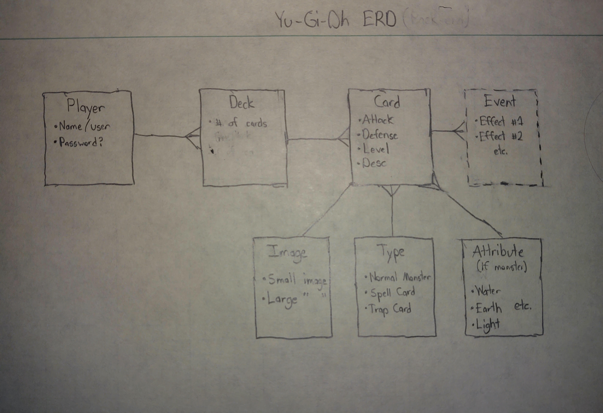

# Deere Project 4 - Back End

## Objective
- Create 2 apps: A Node/Express backend and a React frontend that communicate with each other
- Be a complete product
- Implement thoughtful user stories
- Be deployed online

## Description
This app is meant to simulate the Yu-Gi-Oh! Trading Card Game, a card-based battle game that is basically just glorified math. It is a simplified version, with normal, non-effect monsters and minimal spell/trap cards to make project completion possible. More of the game's logic (ex. effect monsters) will be added as a gold plan.

## API
https://backend-yugioh-thing.herokuapp.com/

## User Stories
- To be able to create new decks
- To be able to name those decks for clarity's sake
- In navigating those decks, be able to add cards
- Similarly, be able to delete cards from said deck

## The Plan
- ERD:


## The Approach
As indicted in the ERD, the deck associated with Yu-Gi-Oh revolves around the concept of many other trading card games. In short, each user can have many decks. Each deck has an associated amount of cards. Each card has different traits associated with it, or in this case a name, description, type (monster, spell, trap), etc.

It is therefore due to this logic that:
- The user and deck is a one to many association. In other words, each user has many decks, but each deck belongs to one user.
- The deck and card is a many to many relation. Decks can have many cards, and likewise cards belong in multiple decks.
- Each card has one name, one description, and one type

With the model structure in place, the controller is the other vital part. Because the deck is associated with a user, a parameter need to be passed in each time to acknowledge who the deck belongs to. For the instance, in the example below, to get all of the decks belonging to a particular user, the userId needs to be indicted, or in this case using req.params.id:

```
// GET USERS DECKS
router.get("/:id", async (req, res) => {
  let decks = await Deck.findAll({
    include: [{ 
      model: Card,
      attributes: ["id", "cardNumber", "name"],
      include: [{
        model: Stat,
        attributes: ["level", "attack", "defense"],
      }],
    }],
    where: { userId: req.params.id }
  })
  res.json({ decks });
});
```

However, when we get into the deck's associations in regards to the card, it is best to use the DeckCard association. Why? Well, because cards are essentially "items" (i.e. they are imported into a list from the official Yu-Gi-OH API), there is no need to create a new card every time. Namely, we just need to connect the deckId to the respective cardID. This is why when adding a card, we simply use:

```
// ADD CARD TO USER'S DECK
router.post("/:id/addcard", async (req, res) => {
  DeckCard.create(req.body)
  res.json({
    message: `Card was added to Deck ${req.params.id}`,
  });
});
```

...where req.body contains info on these respective ids.


## Technologies Used
Javascript ES6   
REST, CRUD  
Sequelize Associations  
Cloud-based Hosting (Heroku)  
Bootstrap

## Unsolved issues/Future Improvements
- Use verifyToken the eliminated the need for a userID input
   - Originally, verifyToken middleware was used to provide req.user login info
   - This eliminated the need for a param input for the user ID
   - However, React does not play well with Express without ceratin authentication
      - Throws 401 (Unauthorized) network status
   - Though this could have been patched, the technicality behind this was too lengthy for this project timeline
- As a result of the first bullet, the Sequelize assocations are not the most efficient


