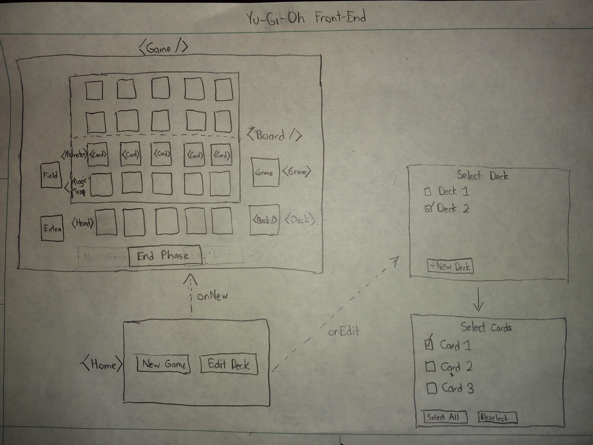

## Deere Project 4

This app is meant to simulate the Yu-Gi-Oh! Trading Card Game, a card-based battle game that is basically just glorified math. It is a simplified version, with normal, non-effect monsters and minimal spell/trap cards to make project completion possible. More of the game's logic (ex. effect monsters) will be added as a gold plan.

## The Plan
- Wireframe:

For a user's sake, the building the deck is meant to be a simple process. As such, I don't imagine it having very many screens. Within those few screens, a user should be able to:

- Sign up for a new deck building account or login to an existing one
- Retitle the name of their decks for clarity
- Add and delete decks

By clicking on each deck entry, the app will then display the cards in that particular deck. Once there, they can likewise:

- Add a pre-built card to their deck
- Delete cards

For a stretch goal, the plan is to play the actual Yu-Gi-Oh game with their built deck. As indicted in the wireframe, this consists of the most components, including a Game, Board, Hand, Card(s), etc.